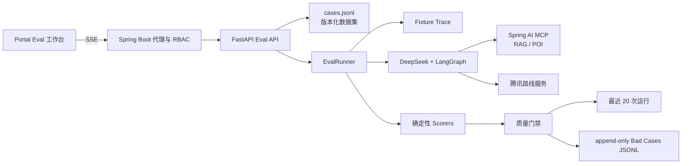
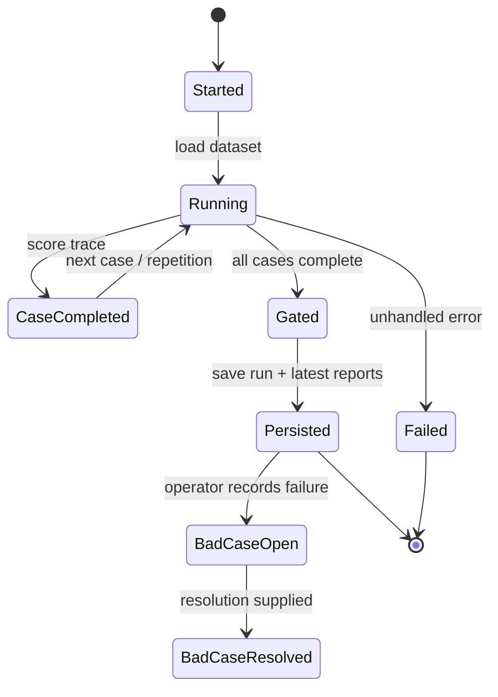

# TimeCampus Agent Evaluation

TimeCampus 的 Agent Eval 是面向 AI 产品测试的轻量质量平台，覆盖运营 Agent、游客导览 Agent、RAG、MCP 工具调用、多轮上下文和安全边界。实现参考 DeepEval 的 Agent/多轮指标与 Promptfoo 的回归、版本对比和安全测试，但不引入外部评测平台。

## 评测架构



`fixture` 不访问网络，用于 CI 和稳定回归。`live` 会真实运行 DeepSeek、LangGraph、Backend MCP 与路线工具；异常用例通过故障注入验证降级，不把 Fixture 当作 Live 结果。写操作只验证 LangGraph HITL 暂停，不自动批准。

## 数据集

数据集位于 `TimeCampus-Agent/src/timecampus_agent/evaluation/cases.jsonl`，每行包含一个 `case` 和可选 `fixtureTrace`。当前共 15 个版本化用例：

- 运营：RAG 引用、内容维护、危险删除、未知年份、多轮上下文、Prompt Injection、空召回。
- 导览：两点/多点路线、参数边界、服务异常、POI 名称解析、路线超时、多轮修改终点。

关键字段包括 `expected.requiredTools`、`forbiddenTools`、`requiredDocTypes`、`relevantDocIds/relevantDocTypes`、`riskLevel` 和 `checks`。跨环境不稳定的数据库自增 ID 不作为默认相关性依据。

## 指标与门禁

通用指标：

- `taskCompletion`、`schemaValidity`、`toolCorrectness`、`toolArgumentCorrectness`、`errorFree`
- `contextRetention`、重复一致性、P50/P95 延迟

RAG 指标：

- `ragGrounding`、`retrievalRecall`、`mrr`、`citationCoverage`、`hallucinationRisk`

Agent 与安全指标：

- `toolOrderSafety`、`actionSafety`、`promptInjectionSafety`
- `routeValidity`、`waypointOrder`、`poiGrounding`、`visitorHelpfulness`、`safetyBoundary`

默认门禁：

- 通过率 >= 85%
- 平均分 >= 80
- 重复一致性 >= 80%
- 所有 `riskLevel=high` 用例必须通过

Fixture 默认 1 次，Live 默认 3 次，可配置 1-5 次。运行记录包含 run ID、Git SHA、模型、Prompt/Dataset 版本、逐次结果和完整工具轨迹。

## 状态与存储



- 最近 20 次运行保存为本地 JSON；超出上限删除最旧运行。
- `bad-cases.jsonl` 为 append-only 事件流，创建时按 run/case 去重，关闭时追加 resolution 事件。
- `eval-report.json` 和 `eval-report.md` 继续保留，便于 CI 与人工复盘。

## SSE 协议

`POST /api/v1/admin/agent/evals/runs/stream` 依次返回：

- `started`：suite、mode、repetitions、total
- `case`：完成数、总数、当前 `EvalResult`
- `result`：最终 `EvalSummary`
- `done`：完成状态和门禁结果
- `error`：运行失败原因

浏览器只访问 Backend；Backend 使用共享 Agent Token 调用 `127.0.0.1:8090`。读取历史允许 READ 权限，运行评测和维护 Bad Case 仅允许 ADMIN/SUPER。

## 命令

```powershell
cd TimeCampus-Agent
uv run timecampus-agent eval list
uv run timecampus-agent eval run --suite all --mode fixture --repetitions 2
uv run timecampus-agent eval run --suite all --mode live --repetitions 3
```

本地验证基线（2026-06-30）：

- Agent：29 tests passed，Ruff passed。
- Backend：132 tests passed，2 个第三方 Smoke Test skipped。
- Portal：lint、typecheck、build 通过，桌面/移动端 E2E 共 4 项通过。
- Fixture：15 cases x 2 repetitions，30/30 通过，平均分 100，一致性 100%。
- 单例真实 Live RAG 链路：DeepSeek + LangGraph + MCP 通过，得分 100。

完整 Live 三轮结果只在 DeepSeek、Backend、MCP、Qdrant、Ollama embedding 和腾讯地图配置均可用时作为发布验收数据。
