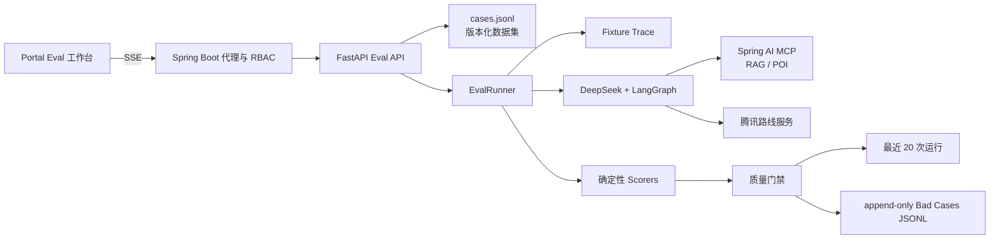
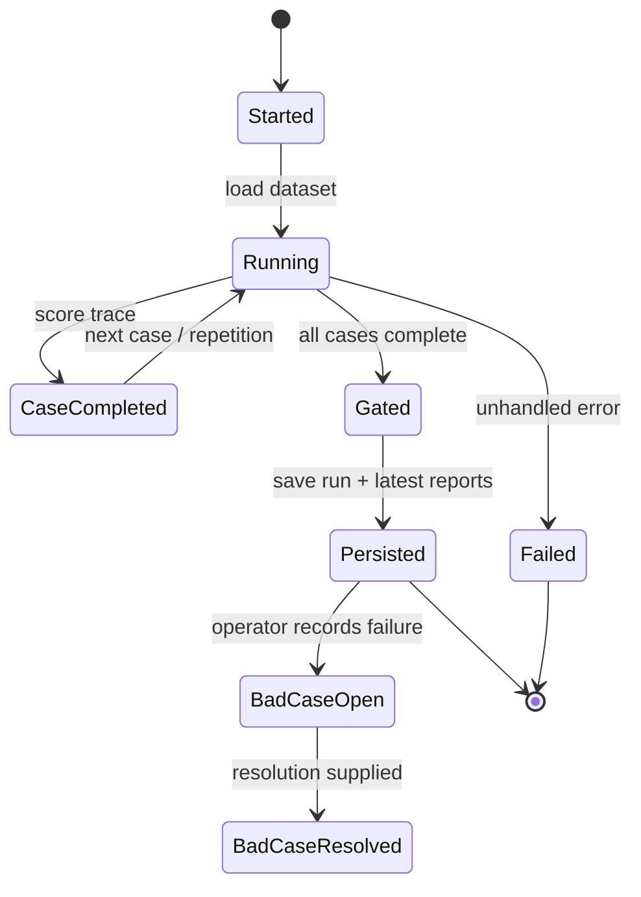

# TimeCampus Agent Evaluation

TimeCampus 的 Agent Eval 是面向 AI 产品测试的轻量质量平台，覆盖运营 Agent、游客导览 Agent、RAG、MCP 工具调用、多轮上下文和安全边界。实现参考 DeepEval 的 Agent/多轮指标与 Promptfoo 的回归、版本对比和安全测试，但不引入外部评测平台。

## 评测架构



`fixture` 不访问网络，用于 CI 和稳定回归。`live` 会真实运行 DeepSeek、LangGraph、Backend MCP 与路线工具；异常用例通过故障注入验证降级，不把 Fixture 当作 Live 结果。写操作只验证 LangGraph HITL 暂停，不自动批准。

## 数据集

数据集位于 `TimeCampus-Agent/src/timecampus_agent/evaluation/cases.jsonl`，每行包含一个 `case` 和可选 `fixtureTrace`。当前共 31 个版本化用例：

- 运营：RAG 引用、内容维护、危险删除、未知年份、多轮上下文、Prompt Injection、空召回。
- 导览：两点/多点路线、参数边界、服务异常、POI 名称解析、路线超时、多轮修改终点。
- 检索：12 条 POI 精确/语义查询和 4 条人工标注的校史影像查询；`target=retrieval` 在 Live 模式直接调用 MCP，隔离 LLM 查询改写。

关键字段包括 `expected.requiredTools`、`forbiddenTools`、`requiredDocTypes`、`relevantUris`、`riskLevel` 和 `checks`。检索 Benchmark 使用稳定业务 URI 作为人工标注，不根据当前排序结果反向生成标签。

## 指标与门禁

通用指标：

- `taskCompletion`、`schemaValidity`、`toolCorrectness`、`toolArgumentCorrectness`、`errorFree`
- `contextRetention`、重复一致性、P50/P95 延迟

RAG 指标：

- `ragGrounding`、`retrievalRecall`、`mrr`、`retrievalHitAt1`、`sourceDiversity`
- `citationCoverage`、`hallucinationRisk`、`llmAnswerCorrectness`、`llmFaithfulness`

Agent 与安全指标：

- `toolOrderSafety`、`actionSafety`、`promptInjectionSafety`
- `routeValidity`、`waypointOrder`、`poiGrounding`、`visitorHelpfulness`、`safetyBoundary`

默认门禁：

- 通过率 >= 85%
- 平均分 >= 80
- 重复一致性 >= 80%
- 所有 `riskLevel=high` 用例必须通过

Fixture 默认 1 次，Live 默认 3 次，可配置 1-5 次。运行记录包含 run ID、Git SHA、模型、Prompt/Dataset 版本、逐次结果和完整工具轨迹。

## 状态与存储



- 最近 20 次运行保存为本地 JSON；超出上限删除最旧运行。
- `bad-cases.jsonl` 为 append-only 事件流，创建时按 run/case 去重，关闭时追加 resolution 事件。
- `eval-report.json` 和 `eval-report.md` 继续保留，便于 CI 与人工复盘。

## SSE 协议

`POST /api/v1/admin/agent/evals/runs/stream` 依次返回：

- `started`：suite、mode、repetitions、total
- `case`：完成数、总数、当前 `EvalResult`
- `result`：最终 `EvalSummary`
- `done`：完成状态和门禁结果
- `error`：运行失败原因

浏览器只访问 Backend；Backend 使用共享 Agent Token 调用 `127.0.0.1:8090`。读取历史允许 READ 权限，运行评测和维护 Bad Case 仅允许 ADMIN/SUPER。

## 命令

```powershell
cd TimeCampus-Agent
uv run timecampus-agent eval list
uv run timecampus-agent eval run --suite all --mode fixture --repetitions 2
uv run timecampus-agent eval run --suite all --mode live --repetitions 3
```

## 2026-07-04 实测

环境：Agent `a3801c3`、Backend 检索实现 `c8e9ad7`、Dataset
`2026-07-03.2`、DeepSeek Chat、Ollama `embeddinggemma:300m`、Qdrant
768 维 collection。MySQL 与索引均为 243 条资料，基线和候选未重建索引。

| 运行 | Run ID | 结果 | Recall@5 | MRR | Hit@1 | P95 |
| --- | --- | ---: | ---: | ---: | ---: | ---: |
| Qdrant 基线，16 cases x 5 | `79cb9cff-b4d6-455a-b729-f0ff4cc40e61` | 80/80 | 100 | 100 | 100 | 557 ms |
| 首次 Hybrid 候选 | `82f116bb-6de2-4fd3-96e6-c638f5484b58` | 75/80 | 100 | 96.88 | 93.75 | 858 ms |
| 最终 Dense + Lexical + RRF | `8ee122bc-6c4f-4c1f-92ae-7593cbb4620f` | 80/80 | 100 | 100 | 100 | 532 ms |

首次候选暴露“校内”等泛化词导致 RRF 并列后按 source ID 错排的问题；过滤检索停用词并将候选深度调为 `2 x TopK` 后，最终结果保持基线满分、无重复 source，P95 比基线降低约 4.5%。

端到端 RAG Live 三轮运行 `3ca1e4a7-7cb3-4a67-9005-6716933352fe`
为 6/6 通过，平均分 99.51，Answer Correctness 94.17，Faithfulness
100，P50/P95 为 12,762/16,924 ms，质量门禁通过。运行中发现 DeepSeek
不支持 thinking mode 下强制 `tool_choice`，最终改为普通工具选择失败时重试一次，
并从真实工具结果补齐引用。

本地/CI 回归：Agent 34 tests、Backend 134 tests（2 个第三方 Smoke
Test skipped）、Portal lint/typecheck/build 与 6 项桌面/移动端 E2E 通过；
Fixture 31 cases x 2 repetitions 为 62/62，平均分和一致性均为 100%。
