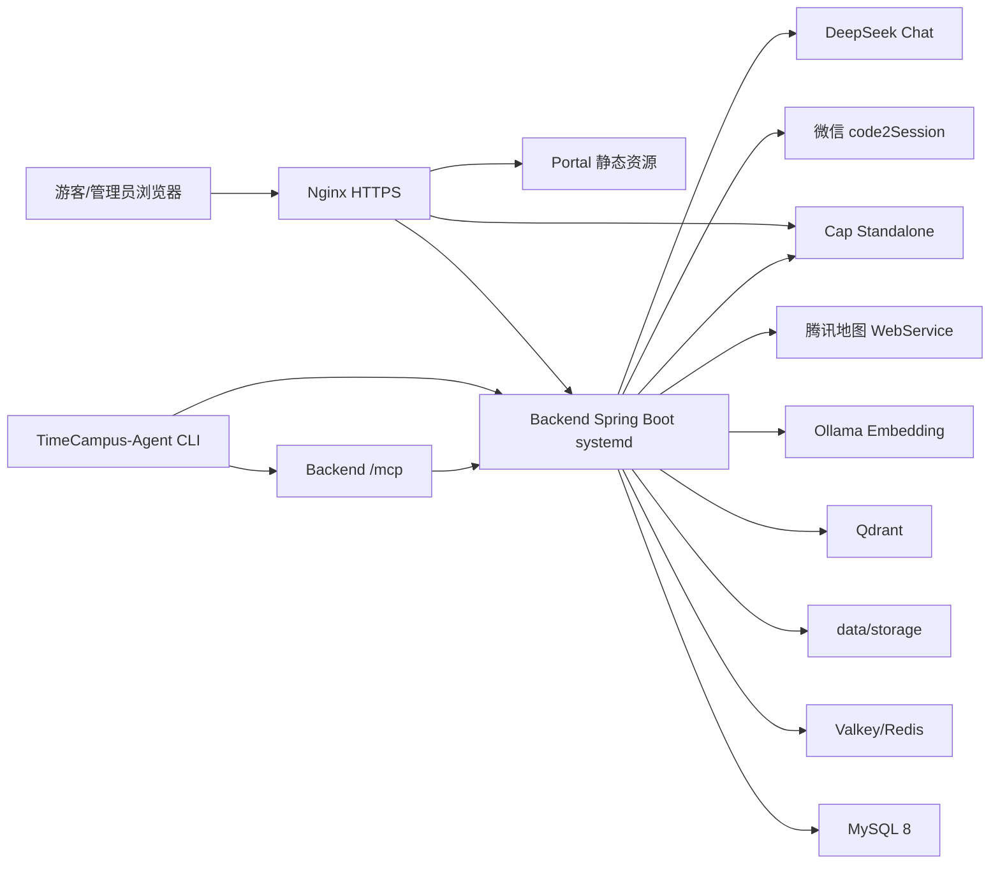

# TimeCampus 技术规格说明书

版本：`0.3.0-beta`
基线日期：2026-06-15
适用范围：根仓库、`TimeCampus-Portal`、`TimeCampus-Backend`、`TimeCampus-Agent`

本文档描述 TimeCampus 的技术架构、模块边界、数据模型、接口分组、配置、部署和质量要求。功能范围与业务验收见 [功能规格说明书](functional-spec.md)。

## 1. 系统概览

TimeCampus 根仓库是生产编排仓库，使用 Git submodule 管理三个子模块：

- `TimeCampus-Portal`：React 门户、公开校园地图、时光合影工作室和 Web 管理端。
- `TimeCampus-Backend`：Spring Boot 多模块后端、REST API、MCP Server、RAG 和第三方服务封装。
- `TimeCampus-Agent`：独立纯 Python CLI，用于后台运营维护、RAG 检索、草案生成和游客导引。

生产运行时由 Nginx 统一暴露 HTTPS，Nginx 提供门户/管理端静态资源、API 反向代理和 Cap 反向代理；Backend 以 jar + systemd 运行，访问 MySQL、Valkey、Qdrant、Ollama、Cap、腾讯地图、微信和 DeepSeek 等服务。根 Compose 只负责 Valkey、Cap、Qdrant、Ollama 等依赖服务。



## 2. 技术栈

| 层级 | 技术 |
| --- | --- |
| 根编排 | Docker Compose 依赖服务、Git submodule、PowerShell/Python 运维脚本 |
| Portal | React 19、TypeScript 5.9、Vite 8、Tailwind CSS 4、shadcn/ui、Radix UI、lucide-react、GSAP、markstream-react、cap-widget |
| Backend | Java 21、Spring Boot 3.5.14、Spring AI 1.1.7、Spring MVC、MyBatis、Maven、Springdoc OpenAPI |
| 数据与缓存 | MySQL 8、Valkey/Redis、Qdrant 1.14.1、本地/COS 挂载文件存储 |
| AI/RAG | Spring AI MCP Server、Qdrant VectorStore、Ollama `embeddinggemma:300m`、可选智谱 embedding、DeepSeek Chat |
| Agent | Python 3.12、uv、FastAPI、Uvicorn、httpx、pydantic、pytest、ruff |
| 第三方服务 | 腾讯地图 JS API 和 WebService、微信小程序 code2Session、Cap CAPTCHA |

## 3. 仓库结构

```text
TimeCampus/
  compose.yaml                 # 生产 Compose 编排
  .env.example                 # 根编排环境变量样例
  docs/                        # 项目级规格、部署、联调文档
  tools/                       # 部署、后端 MCP 启动、冒烟脚本
  TimeCampus-Portal/           # React 门户和管理端
  TimeCampus-Backend/          # Spring Boot 后端
  TimeCampus-Agent/            # Python Agent CLI
```

## 4. 模块设计

### 4.1 Portal

职责：

- 渲染门户首页、项目详情、小程序说明、公开校园地图和时光合影工作室。
- 渲染 Web 管理端，调用 Backend 管理端 API。
- 根据 `VITE_ADMIN_DOMAIN`、`VITE_PORTAL_DOMAIN` 和 `VITE_ADMIN_REDIRECT` 处理管理端域名跳转。
- 提供 Seedream 图生图入口，但只上传人物图、白名单背景 id 和 Cap token，不提供自由 prompt。
- 通过 `src/api/request.ts` 统一处理 `/api/v1` 前缀、JSON 请求、FormData 和管理员 token。
- 通过 Backend SSE 代理消费运营智能体 token，并使用 `markstream-react` 渲染流式 Markdown。

关键目录：

```text
src/
  api/                  # Backend API 适配层
  components/           # 通用组件、管理端 shell、shadcn/ui
  data/                 # 静态历史数据和公开展示数据
  features/admin/       # 管理端复杂业务模块
  lib/                  # 工具函数、腾讯地图加载器
  pages/                # 路由级页面
```

路由策略：

- `App.tsx` 使用浏览器 History API 管理轻量路由。
- `/campus-map` 通过 `React.lazy` 延迟加载。
- `/admin/*` 在管理端域名下转换为无 `/admin` 前缀的浏览器路径，在内部仍映射到管理端页面。
- 生产主站访问 `/admin`、`/admin/*`、`/login` 和 `/register` 时跳转到管理端域名；`VITE_ADMIN_REDIRECT=false` 只用于本地预览。
- 本地 Vite 开发服务器代理 `/api` 到 `http://localhost:8080`。

环境变量：

| 变量 | 用途 |
| --- | --- |
| `VITE_API_BASE_URL` | 可选，指定完整 API base URL；缺省使用同源 `/api/v1` |
| `VITE_TENCENT_MAP_KEY` | 腾讯地图 JS Key，仅用于前端地图加载 |
| `VITE_CAP_API_ENDPOINT` | Cap site endpoint，不能包含 secret |
| `VITE_ADMIN_DOMAIN` | 管理端生产域名 |
| `VITE_PORTAL_DOMAIN` | 门户生产域名 |
| `VITE_ADMIN_REDIRECT` | 是否把管理端路由强制跳转到管理端域名，本地预览可设为 `false` |

质量命令：

```powershell
pnpm typecheck
pnpm lint
pnpm build
```

### 4.2 Backend

职责：

- 暴露 `/api/v1/**` REST API。
- 管理用户端、管理端、公开 Portal 和 Agent HTTP API。
- 封装 MySQL、Redis/Valkey、文件存储、腾讯地图、微信登录、Cap、DeepSeek、Qdrant 和 Ollama。
- 暴露 `/mcp` Streamable HTTP MCP Server。

Maven 模块：

| 模块 | 职责 |
| --- | --- |
| `timecampus-common` | 统一响应、错误码、业务异常、全局异常、请求 ID、Token 工具 |
| `timecampus-pojo` | DTO、Entity、VO、常量和字段契约 |
| `timecampus-server` | Spring Boot 应用、Controller、Service、Mapper、配置、MCP/RAG、测试 |

分层：

```text
controller/             # admin、user、publicapi 控制器
service/                # 业务接口
service/impl/           # 业务实现
mapper/                 # MyBatis Mapper 接口
resources/mapper/       # Mapper XML
mcp/                    # MCP Tools/Resources/Prompts/RAG/Agent draft
ai/                     # DeepSeek/Ollama/Zhipu 模型适配
config/                 # Web、OpenAPI、Cap、Storage、腾讯地图等配置
```

统一响应：

```json
{"code":0,"message":"ok","data":{}}
```

文件流、静态资源和 `Resource` 响应不包裹统一响应。

鉴权：

- 用户端和管理端均使用 `Authorization: Bearer <token>`。
- Redis/Valkey 存储 token 会话。
- 管理端登录生产环境必须由后端校验 Cap token。
- Portal Seedream 生成接口同样必须由后端校验 Cap token，并通过 Redis/Valkey 对同一 IP 做每日 5 次限流。
- `/api/v1/admin/**` 需要管理员 token，具体写操作受角色限制。
- `/mcp` 生产环境需要 `X-TimeCampus-MCP-Token` 或 `Authorization: Bearer <token>`。

关键实现规则：

- `TimeFillAspect` 自动填充 `createTime` 和 `updateTime`。
- `LocalStorageService`/`MediaFileService` 校验文件路径必须位于 `storage.local-root-dir` 下。
- 用户端媒体 URL 使用短期 accessToken，默认 TTL 600 秒。
- 腾讯地图 SK 存在时使用签名请求；签名逻辑由 `TencentMapSignature` 覆盖测试。
- RAG 在生产并行执行 Qdrant Dense 与中文词法检索，按 source ID 去重后使用 RRF 融合；任一检索器异常或空结果时自动退化为另一条链路。

质量命令：

```powershell
mvn test
mvn -pl timecampus-server -am spring-boot:run
```

### 4.3 Agent

职责：

- 提供本地运维 CLI，调用 Backend API/MCP。
- 将 RAG 检索、草案生成、游客路线规划包装为可脚本化命令。
- 保持 Agent 编排独立于 Portal，避免前端承担维护智能体逻辑。

主要模块：

| 文件 | 职责 |
| --- | --- |
| `config.py` | 从 `.env` 加载 API、管理员凭据、聊天模型和 MCP 配置 |
| `backend.py` | Backend REST API typed client |
| `tools.py` | Python 工具包装 |
| `mcp_client.py` | Backend MCP 工具加载 |
| `agent.py` | Python supervisor，分流运营智能体和游客导引智能体 |
| `service.py` | FastAPI 内部鉴权、运营 session、SSE、HITL 与 Eval 接口 |
| `memory.py` | JSONL 会话原子持久化和 `MEMORY.md` 长期运营约束 |
| `cli.py` | `timecampus-agent` 命令入口 |

CLI 命令：

```powershell
uv run timecampus-agent rag-search "主楼旧照"
uv run timecampus-agent draft "为主楼补充面向游客的简介"
uv run timecampus-agent ask "检索主楼资料并给出维护计划"
uv run timecampus-agent ask --agent guide "主楼到图书馆怎么走？"
uv run timecampus-agent route "主楼,39.981,116.34;图书馆,39.982,116.341"
uv run timecampus-agent mcp-tools
```

质量命令：

```powershell
uv run pytest
uv run ruff check .
```

## 5. 数据模型

数据库初始化脚本：`TimeCampus-Backend/timecampus-server/src/main/resources/sql/schema.sql`。当前脚本默认不创建物理外键，关联完整性由应用层校验。

| 表 | 说明 | 关键字段 |
| --- | --- | --- |
| `user` | 微信用户 | `openid`、`nickname`、`identity`、`enroll_year` |
| `admin` | 管理员账户 | `admin_name`、`password`、`role`、`status`、`last_login_time` |
| `poi` | 校园点位 | `name`、`latitude`、`longitude`、`description`、`fun_fact`、`status` |
| `media` | 官方/UGC 影像 | `poi_id`、`type`、`image_path`、`year`、`review_status` |
| `favorite` | 收藏关系 | `user_id`、`target_type`、`target_id` |
| `comment` | 评论与评论审核 | `user_id`、`target_type`、`target_id`、`content`、`review_status` |
| `log` | 审计日志 | `operator_type`、`operator_id`、`type`、`action`、`target_type`、`detail` |

说明：

- Backend `MeController` 暴露 notes/memos 相关接口；若该能力继续保留，需要补齐数据库脚本和数据库文档，或在后续版本中移除/隐藏接口。
- 详细字段说明见 [Backend 数据库设计](../TimeCampus-Backend/docs/database.md)。

## 6. API 分组

### 6.1 用户端 API

| 分组 | 路径 |
| --- | --- |
| 健康检查 | `GET /api/v1/health`、`GET /api/v1/actuator/health` |
| 微信登录 | `POST /api/v1/auth/wechat/login` |
| 当前用户 | `GET /api/v1/me`、`/api/v1/me/review-results/**` |
| 用户查询 | `GET /api/v1/users/{id}`、`/api/v1/users/{id}/review-results/**` |
| POI | `GET /api/v1/pois`、`GET /api/v1/pois/{id}` |
| 内容 | `GET /api/v1/pois/{id}/contents`、`GET /api/v1/contents/{id}`、`GET /api/v1/timeline` |
| 收藏 | `POST/DELETE/GET /api/v1/favorites`，兼容 `/api/v1/users/favorites` |
| UGC | `POST /api/v1/ugc` |
| 评论 | `POST /api/v1/comments`、`GET /api/v1/comments/{targetType}/{targetId}`、`GET /api/v1/comments/mine` |
| 地图 | `GET /api/v1/map/home`、`GET /api/v1/map/poi/{poiId}/timemachine`、`GET /api/v1/map/reverse-geocode`、`GET /api/v1/map/poi-search`、`POST /api/v1/map/walking-route` |
| 媒体文件 | `GET /api/v1/media/{id}/file` |

### 6.2 公开 Portal API

| 分组 | 路径 |
| --- | --- |
| 公开地图首页 | `GET /api/v1/portal/map/home` |

### 6.3 管理端 API

| 分组 | 路径 |
| --- | --- |
| 登录/注册 | `POST /api/v1/admin/login`、`POST /api/v1/admin/logout`、`POST /api/v1/admin/register` |
| 管理员账号 | `GET /api/v1/admin/accounts`、`POST /api/v1/admin/accounts/{id}/role`、`POST /api/v1/admin/accounts/{id}/status` |
| Dashboard | `GET /api/v1/admin/dashboard/stats` |
| POI | `GET/POST /api/v1/admin/pois`、`GET/PUT/DELETE /api/v1/admin/pois/{id}` |
| 内容 | `POST /api/v1/admin/contents/batch-import` |
| 媒体 | `GET/POST /api/v1/admin/media`、`POST /api/v1/admin/media/import`、`POST /api/v1/admin/media/upload`、`GET/DELETE /api/v1/admin/media/{id}`、`GET /api/v1/admin/media/{id}/file`、`PUT /api/v1/admin/media/{id}/approve|reject` |
| UGC | `GET /api/v1/admin/ugc`、`POST /api/v1/admin/ugc/{id}/approve|reject` |
| 评论 | `GET /api/v1/admin/comments`、`POST /api/v1/admin/comments/{id}/approve|reject` |
| 运营地图 | `GET /api/v1/admin/map/overview`、`GET /api/v1/admin/map/config` |
| 日志 | `GET /api/v1/admin/logs` |
| Agent | `POST /api/v1/admin/agent/rag/search`、`/rag/context-pack`、`/rag/rebuild-index`、`/draft`、`/operations/runs`、`GET/POST /operations/sessions`、`POST /operations/sessions/{id}/messages/stream`、`/evals/runs` |
| Portal Seedream | `GET /api/v1/portal/seedream/backgrounds`、`GET /api/v1/portal/seedream/backgrounds/{id}/preview`、`POST /api/v1/portal/seedream/generations` |

### 6.4 MCP

默认端点：

```text
POST/GET /mcp
```

MCP 提供 POI、影像、RAG 和文案维护 Tools，提供 POI、media、dashboard、content-guidelines、rag/corpus 等 Resources，并提供 POI 编辑、影像导入、文案润色、内容巡检和 RAG grounded maintenance Prompts。详见 [Backend MCP Server](../TimeCampus-Backend/docs/mcp-server.md)。

## 7. 集成服务

| 服务 | 使用位置 | 说明 |
| --- | --- | --- |
| MySQL | Backend | 业务数据主存储 |
| Valkey/Redis | Backend、Cap | token、会话、Seedream 生成限流和 Cap 限流存储 |
| 本地/COS 挂载存储 | Backend | 图片文件保存和读取 |
| Tencent Map JS API | Portal | 公开地图和运营地图前端渲染 |
| Tencent Map WebService | Backend | 逆地理编码、POI 搜索、步行路线 |
| WeChat code2Session | Backend | 小程序登录 |
| Cap Standalone | Portal、Backend | 管理端登录和公开生图的人机验证，后端服务端校验 |
| Qdrant | Backend | 可选向量检索 |
| Ollama | Backend | 生产默认 `embeddinggemma:300m` 768 维 embedding |
| DeepSeek Chat | Backend、Agent | 管理端草案生成和 Agent chat model |
| Agent 本地文件 | Agent | `sessions/*.jsonl` 对话历史和 `MEMORY.md` 长期运营约束 |

## 8. 配置与密钥

根仓库 `.env.example` 只覆盖 Compose 依赖服务变量，Backend `application-*-example.yaml` 和服务器 `~/app/config` 覆盖 Spring 配置，Portal `.env.example` 覆盖前端构建配置，Agent `.env.example` 覆盖 CLI 配置。真实密钥不得提交。

关键根变量：

| 变量 | 用途 |
| --- | --- |
| `REDIS_PASSWORD` | Valkey/Redis 密码；非空时 Backend 和 Cap 配置必须同步 |
| `QDRANT_HTTP_PORT`、`QDRANT_GRPC_PORT` | Qdrant 本机绑定端口 |
| `OLLAMA_PORT`、`OLLAMA_EMBEDDING_MODEL` | Ollama 本机绑定端口和启动后拉取的 embedding 模型 |
| `CAP_ADMIN_KEY`、`CAP_CORS_ORIGIN`、`CAP_REDIS_URL` | Cap Standalone 管理密钥、跨域来源和 Redis 连接 |

Backend 数据库、MCP、DeepSeek、腾讯地图、微信、Seedream、文件存储和 Cap secret 等应用配置不再放在根 compose 环境变量中，生产以服务器 `~/app/config` 为准。

## 9. 部署架构

生产入口和运行服务：

- `valkey`：Redis 兼容缓存与 token 存储。
- `qdrant`：向量库，默认只绑定服务器本机端口。
- `ollama` 和 `ollama-pull-embedding`：embedding 模型服务和模型拉取任务。
- `cap`：自托管 Cap Standalone。
- `timecampus-backend.service`：Spring Boot API，使用 `prod` profile，以 jar + systemd 运行。
- `timecampus-agent.service`：FastAPI 内部服务，仅监听 `127.0.0.1:8090`，会话目录挂载到持久磁盘。
- Nginx：HTTPS、静态资源、门户/管理端/API/Cap 路由。

域名路由见 [生产部署说明](deploy.md)。生产公网入口只暴露 Nginx `80/443`；Backend、Cap、Qdrant、Ollama 默认绑定 `127.0.0.1`，Valkey 留在 Docker 网络内。

启动流程摘要：

```bash
git submodule update --init --recursive
cp .env.example .env
docker compose --env-file .env -f compose.yaml up -d
```

首次启动后需要初始化 Cap site key/secret，写入后端生产配置并重启 `timecampus-backend.service`。RAG 向量索引需要通过 MCP 工具或管理端 Agent API 重建。

## 10. 测试与质量门槛

| 模块 | 命令 | 目的 |
| --- | --- | --- |
| Backend | `mvn test` | 单元、服务、控制器、回归、第三方封装测试 |
| Backend 指定服务 | `mvn -pl timecampus-server -am test` | 服务模块及依赖测试 |
| Portal | `pnpm typecheck` | TypeScript 类型检查 |
| Portal | `pnpm lint` | ESLint 检查 |
| Portal | `pnpm build` | 生产构建验证 |
| Agent | `uv run pytest` | CLI、配置、MCP client 测试 |
| Agent | `uv run ruff check .` | Python 静态检查 |
| Agent | `uv run timecampus-agent eval run --suite all --mode fixture --report-dir eval-reports --min-pass-rate 0.85 --min-overall 80` | Agent 评估框架 fixture 门禁 |
| 根编排 | `uv run --with pyyaml python -m unittest discover -s tests` | Compose 拓扑回归验证 |
| 根编排 | `docker compose --env-file .env -f compose.yaml config` | Docker Compose 配置验证 |
| API smoke | `node tools/agent-smoke.mjs --dry-run` | Agent/路线接口冒烟 |

第三方真实冒烟测试默认应跳过，只有配置真实 key 并显式开启环境变量时运行。

## 11. 可维护性要求

- README 作为入口，不复制完整规格；跨模块事实写入 `docs/`。
- 接口变化同步控制器测试、OpenAPI/ApiFox、功能规格和技术规格。
- 数据表变化同步 `schema.sql`、实体/DTO/VO 测试和数据库文档。
- 配置变化同步所有相关 `.env.example` 或 `application-*-example.yaml`。
- Agent/MCP 写工具必须保留安全门槛、确认参数和“先读后写”约束。
- Portal 页面不得直接散落 `fetch`；API 调用统一进入 `src/api`。
- Backend Controller 只做协议适配，业务规则放 Service，SQL 放 Mapper XML。
- 文档发现不一致时，在 [文档维护指南](documentation-maintenance.md) 中记录修复路径或同步检查。

## 12. 当前已知同步点

- `schema.sql` 当前只包含核心表；若 notes/memos 接口继续保留，需要补齐初始化脚本与数据库设计文档。
- Portal 管理端通过 `/admin/agent-operations` 提供质量门禁与 HITL 审批，通过 `/admin/agent-eval` 提供 Fixture/Live 评测。
- Portal `package.json` 当前没有 `test:agents` 脚本；相关验收命令应使用 `pnpm typecheck`、`pnpm lint`、`pnpm build`、根目录 `tools/agent-smoke.mjs` 和 `TimeCampus-Agent` eval fixture 门禁。
